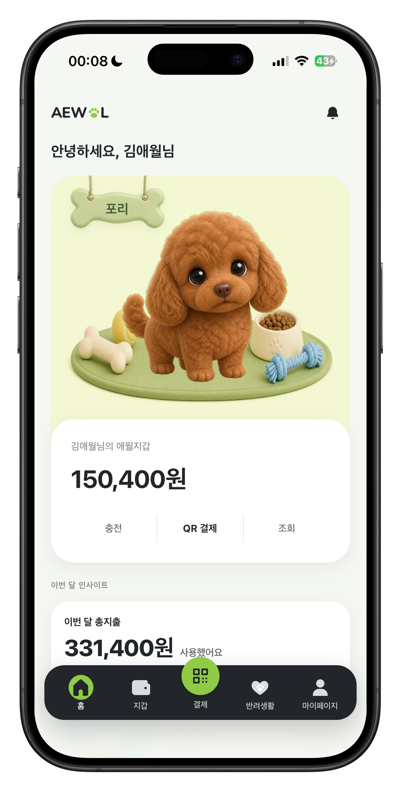
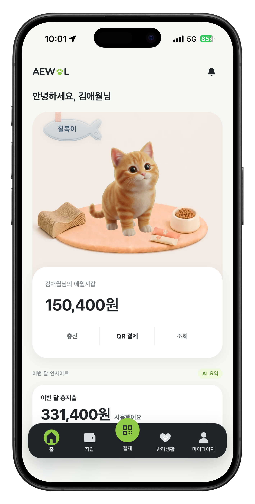
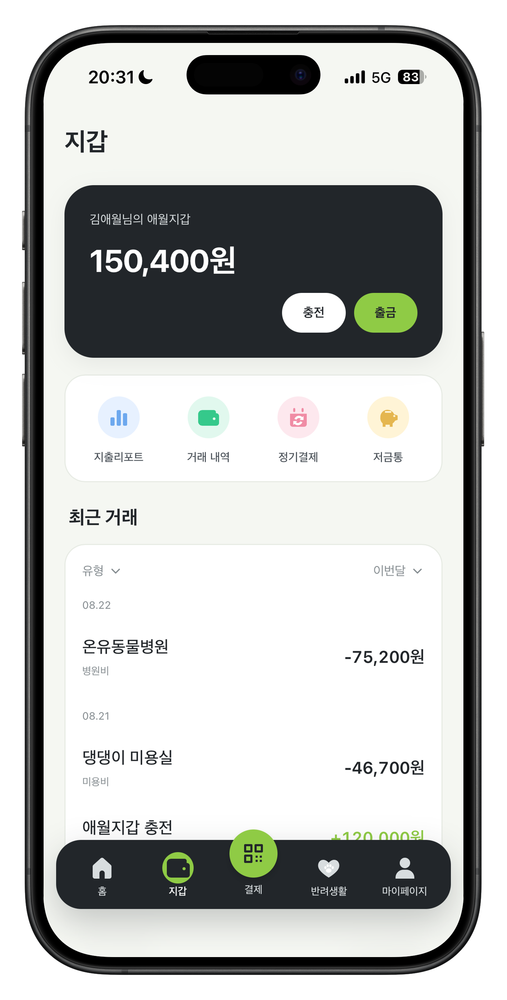
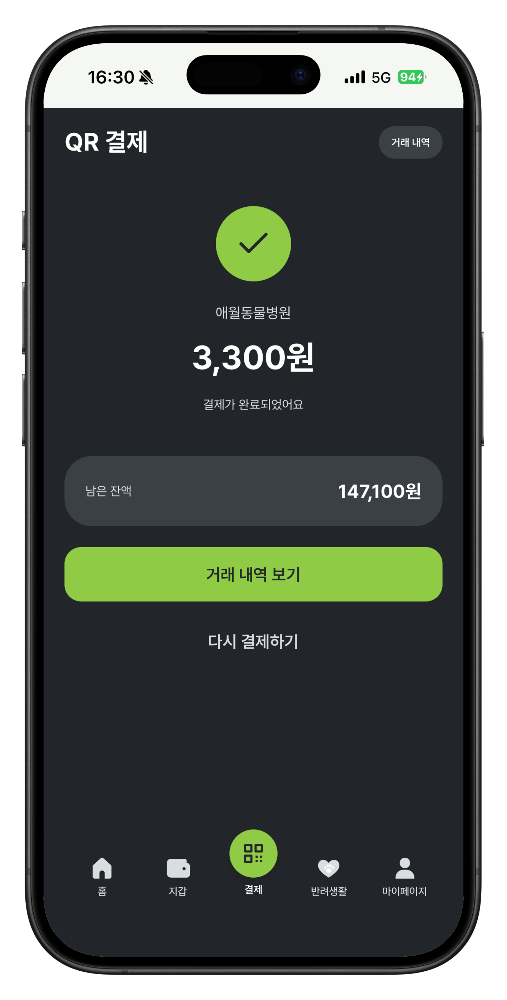
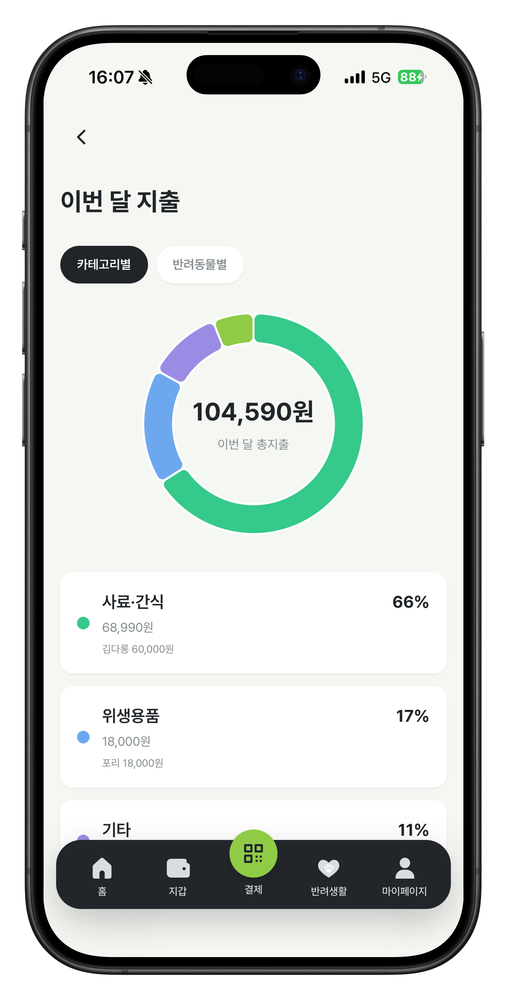
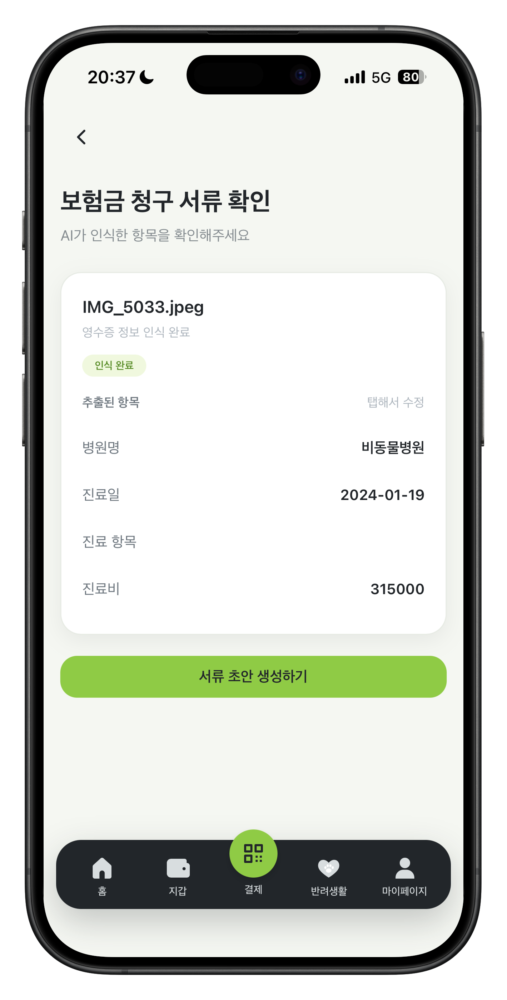
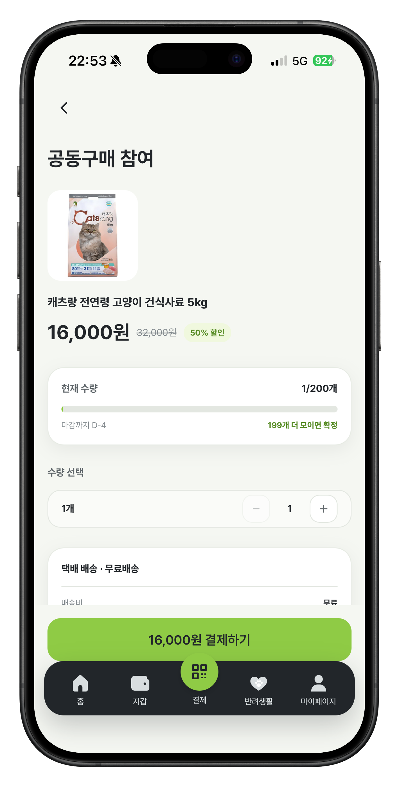
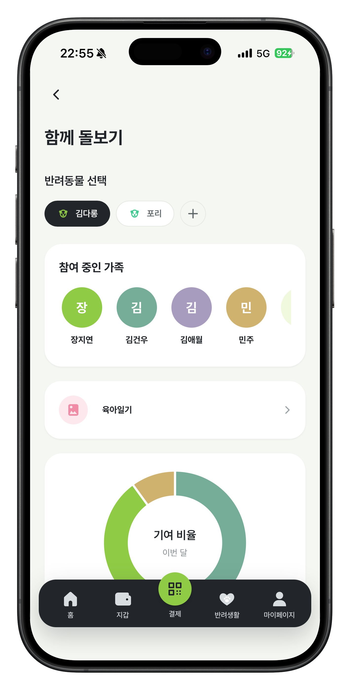

# 애월 (Aewol)

> 반려동물의 일상과 금융을 하나의 지갑으로 연결하는 반려동물 전용 전자지갑 서비스

> 🏆 **KB IT's Your Life 7기 종합실무 프로젝트 최우수상**

[서비스 바로가기](https://www.aewol.store) · [Frontend](https://github.com/PJT-28-2/aewol-frontend) · [Backend](https://github.com/PJT-28-2/aewol-backend)


애월은 의료비, 보험, 정기결제, 가족이 함께 부담하는 양육비처럼 흩어진 반려동물 관련 지출을 한곳에서 관리하도록 돕습니다. 지갑 충전과 QR 결제부터 지출 분석, 보험 청구 보조까지 보호자의 반복적인 금융·행정 업무를 간단하게 만드는 것을 목표로 합니다.

## 프로젝트 한눈에 보기

| 구분 | 내용 |
| --- | --- |
| **프로젝트** | 반려동물 전용 전자지갑 및 생활 관리 서비스 |
| **진행 기간** | 2026.07 ~ 2026.08 |
| **참여 인원** | 6명 |
| **플랫폼** | Mobile-first Web Application |
| **주요 기능** | 전자지갑·QR 결제·지출 분석·보험 청구·공동구매·함께 돌보기 |
| **수상** | KB IT's Your Life 7기 종합실무 프로젝트 최우수상 |

## 주요 화면

<table>
  <tr>
    <th width="50%">강아지 메인 화면</th>
    <th width="50%">고양이 메인 화면</th>
  </tr>
  <tr>
    <td align="center" valign="middle">
      
    </td>
    <td align="center" valign="middle">
      
    </td>
  </tr>
  <tr height="70">
    <td align="center" valign="middle">
      <sub>반려동물과 지갑 잔액, 월간 지출을<br>한눈에 확인할 수 있습니다.</sub>
    </td>
    <td align="center" valign="middle">
      <sub>등록한 반려동물에 따라 달라지는<br>맞춤형 홈 화면을 제공합니다.</sub>
    </td>
  </tr>
</table>

<br>

<table>
  <tr>
    <th width="33%">01 애월 지갑</th>
    <th width="33%">02 QR 결제</th>
    <th width="33%">03 지출 분석</th>
  </tr>
  <tr>
    <td align="center" valign="middle">
      
    </td>
    <td align="center" valign="middle">
      
    </td>
    <td align="center" valign="middle">
      
    </td>
  </tr>
  <tr height="70">
    <td align="center" valign="middle"><sub>충전·출금과 거래 내역을<br>하나의 지갑에서 관리합니다.</sub></td>
    <td align="center" valign="middle"><sub>가맹점 QR을 이용해 결제하고<br>잔액과 거래 결과를 확인합니다.</sub></td>
    <td align="center" valign="middle"><sub>월별 지출을 카테고리와 반려동물별로<br>분류하고 소비 비중을 분석합니다.</sub></td>
  </tr>
  <tr>
    <th width="33%">04 보험 청구 보조</th>
    <th width="33%">05 공동구매</th>
    <th width="33%">06 함께 돌보기</th>
  </tr>
  <tr>
    <td align="center" valign="middle">
      
    </td>
    <td align="center" valign="middle">
      
    </td>
    <td align="center" valign="middle">
      
    </td>
  </tr>
  <tr height="70">
    <td align="center" valign="middle"><sub>영수증 정보를 자동으로 추출해<br>보험 청구 정보 작성을 돕습니다.</sub></td>
    <td align="center" valign="middle"><sub>목표 인원을 모아 반려동물 상품을<br>할인된 가격으로 구매합니다.</sub></td>
    <td align="center" valign="middle"><sub>가족을 초대해 육아일기와<br>활동·지출 기여 현황을 공유합니다.</sub></td>
  </tr>
</table>

## 주요 기능

| 기능 | 설명 |
| --- | --- |
| **애월 지갑·결제** | 지갑 충전·출금, QR 결제와 거래 내역 조회를 제공합니다. |
| **지출 관리** | 거래를 자동 분류하고 월별 지출과 반려동물별 소비 흐름을 분석합니다. |
| **반려동물·서류** | 반려동물 정보와 등록증·의료 서류를 한곳에서 관리합니다. |
| **보험 관리** | 보험료를 비교하고 영수증 OCR과 청구 서류 작성을 보조합니다. |
| **함께 돌보기** | 가족을 초대해 육아일기와 활동 기록, 지출 기여 현황을 함께 관리합니다. |
| **생활 지원** | 응급 병원, 지자체 지원사업, 공동구매와 기부 정보를 제공합니다. |

## 프로젝트 배경

반려동물 양육 경험자를 포함한 64명을 조사한 결과, **93.8%가 지출을 체계적으로 관리하지 못하고 있었고**, **73.4%는 서류 관리와 보험 선택에 어려움**을 느끼고 있었습니다.

애월은 이 문제를 `기록하다 → 이해하다 → 관리하다`의 흐름으로 해결합니다. 지출·보험·서류를 한곳에 기록하고, 자동 분류와 분석을 통해 이해하며, 보험·정기결제·잔돈 기부와 같은 실제 관리 행동으로 연결합니다.

> Aewol 사용자 반응 조사, 2026.08, n=64

## 시스템 아키텍처


```text
사용자
  └─ CloudFront
       └─ Aewol Web App (Vue 3)
            └─ REST API
                 └─ Aewol Server (Spring MVC · EC2)
                      ├─ MySQL
                      ├─ Redis
                      ├─ RapidOCR Service
                      └─ Kakao · CODEF · TossPayments · Gemini · OpenAI · 공공데이터 API
```

## 🛠️ 기술 스택

| 영역 | 기술 |
| --- | --- |
| **Frontend** |        |
| **Backend** |      |
| **Data** |    |
| **AI · External** |       |
| **Infrastructure** |    |
| **Monitoring** |   |

## 기술적 성과

- 잔액 차감과 거래 기록을 하나의 트랜잭션으로 처리해 결제 원자성을 보장했습니다.
- 서버 검증, Redis `SET NX`, DB `UNIQUE(order_id)`의 3중 방어로 Toss 충전의 멱등성을 확보했습니다.
- OCR로 추출한 정보를 사용자가 검토·수정하고 보험금 청구서 PDF 초안으로 저장할 수 있도록 구현했습니다.
- 외부 API 호출과 DB 트랜잭션을 분리해 커넥션 풀 고갈이 전체 장애로 번지는 문제를 차단했습니다.
- 20만 건의 공동구매 데이터 환경에서 FULLTEXT ngram 인덱스, 커서 페이지네이션과 복합 인덱스를 적용해 검색 응답을 최대 475배 개선했습니다.
- 잔돈 적립을 건별 트랜잭션으로 분리해 평균 락 보유 시간을 108.96ms에서 13.92ms로 약 87% 단축했습니다.

## 테스트와 협업

> 2026.08 프로젝트 완료 시점 기준

- Backend: JUnit 5 기반 1,449개 테스트
- Frontend: Vitest 기반 560개 테스트
- 총 2,009개 테스트 실행, 실패 0건
- GitHub Actions에서 Backend 빌드·Flyway·테스트와 Frontend 테스트·빌드를 자동 검증합니다.
- GitHub Actions에서 Backend·OCR Docker 이미지를 빌드해 ECR에 저장하고, EC2 운영 환경에 자동 배포합니다.
- 이슈 정의 → 브랜치 개발 → PR 리뷰 → CI 검증 흐름으로 협업했습니다.

## 저장소

| 저장소 | 설명 |
| --- | --- |
| [aewol-frontend](https://github.com/PJT-28-2/aewol-frontend) | Vue 3 기반 모바일 우선 웹 애플리케이션 |
| [aewol-backend](https://github.com/PJT-28-2/aewol-backend) | Spring MVC 기반 API 서버 |

## 팀 이파리

KB IT's Your Life 7기 종합실무 프로젝트 · PJT 28-2

<table>
  <tr>
    <td align="center" valign="top" width="33%">
      <a href="https://github.com/gnvvoo">
        <br>
        <strong>김건우</strong>
      </a><br>
      <sub>보험·응급병원<br>Frontend·Backend<br>배포</sub>
    </td>
    <td align="center" valign="top" width="33%">
      <a href="https://github.com/Daegoo529">
        <br>
        <strong>김대구</strong>
      </a><br>
      <sub>공동구매<br>증명서 연동·관리</sub>
    </td>
    <td align="center" valign="top" width="33%">
      <a href="https://github.com/2019147588">
        <br>
        <strong>김유환</strong>
      </a><br>
      <sub>함께 돌보기·공공혜택<br>기부·AI 이미지</sub>
    </td>
  </tr>
  <tr>
    <td align="center" valign="top" width="33%">
      <a href="https://github.com/michellepae">
        <br>
        <strong>배민주</strong>
      </a><br>
      <sub>계좌·고객지원<br>공통 UI</sub>
    </td>
    <td align="center" valign="top" width="33%">
      <a href="https://github.com/n03yij">
        <br>
        <strong>장지연</strong>
      </a><br>
      <sub>지갑·지출관리<br>정기결제·반려동물 관리</sub>
    </td>
    <td align="center" valign="top" width="33%">
      <a href="https://github.com/yunjaejoo">
        <br>
        <strong>주윤재</strong>
      </a><br>
      <sub>인증·회원관리<br>마이페이지·공통 UI</sub>
    </td>
  </tr>
</table>
