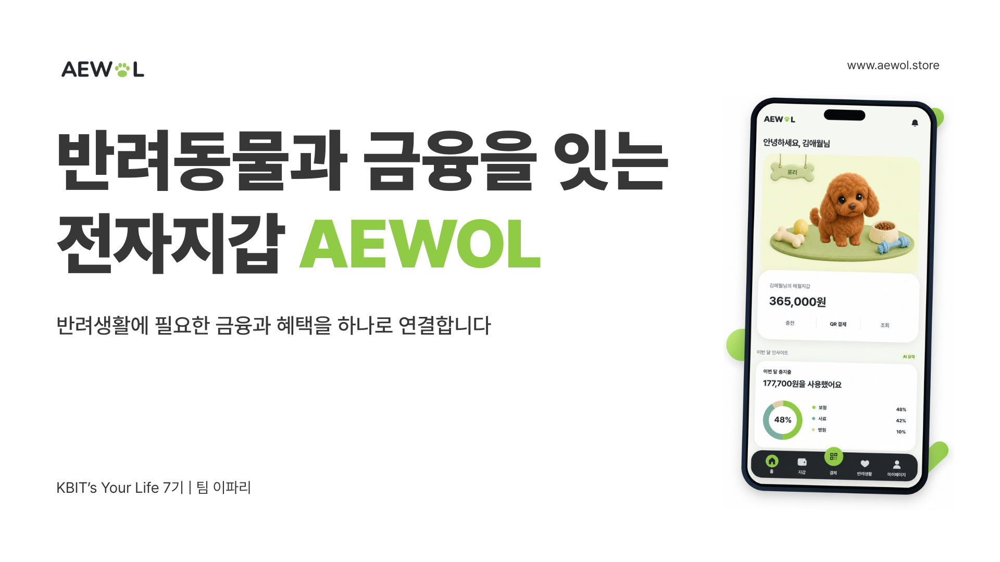
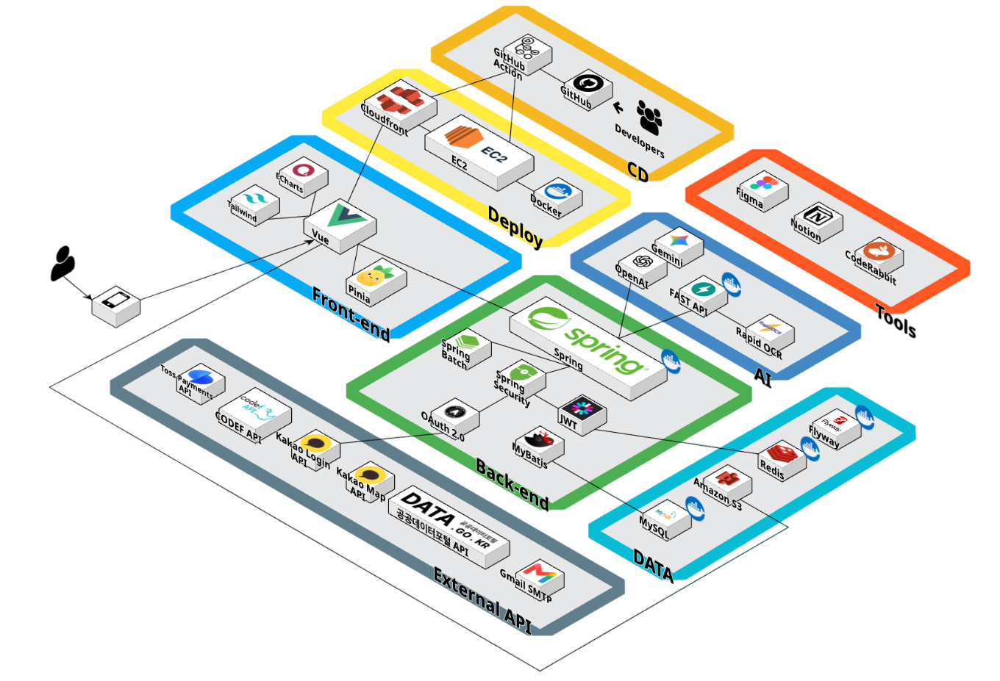

# 애월 (AeWol)

> 반려동물의 일상과 금융을 하나의 지갑으로 연결하는 반려동물 전용 전자지갑 서비스

[서비스 바로가기](https://www.aewol.store) · [Frontend](https://github.com/PJT-28-2/aewol-frontend) · [Backend](https://github.com/PJT-28-2/aewol-backend)



애월은 의료비, 보험, 정기결제, 공동 양육비처럼 흩어져 있는 반려동물 관련 지출을 한곳에서 관리하도록 돕습니다. 목적별 버킷을 활용한 저축부터 지출 분석, 보험 청구 보조까지 보호자의 반복적인 금융·행정 업무를 간단하게 만드는 것을 목표로 합니다.

## 프로젝트 배경

반려동물 양육 경험자를 포함한 64명을 조사한 결과, 93.8%가 지출을 체계적으로 관리하지 못하고 있었고 73.4%는 서류 관리와 보험 선택에 어려움을 느끼고 있었습니다. 응답자의 82.8%가 서비스 사용 의향을 보였으며, 서류 통합 관리와 OCR 기능은 89.1%로 가장 높은 사용 의향을 기록했습니다.

애월은 이 문제를 `기록하다 - 이해하다 - 관리하다`의 흐름으로 해결합니다. 지출·보험·서류를 한곳에 기록하고, 자동 분류와 분석을 통해 이해하며, 보험·정기결제·잔돈 기부 같은 실제 관리 행동으로 연결합니다.

> 조사: AEWOL 사용자 반응 조사, 2026.08, n=64

## 주요 기능

| 기능 | 설명 |
| --- | --- |
| 반려동물 지갑 | 반려동물별 자산과 거래 내역을 한곳에서 관리합니다. |
| 목적별 버킷 | 병원비, 생활비 등 목적에 따라 예산과 저축을 분리합니다. |
| 지출 대시보드 | 거래를 자동 분류하고 월별 지출 흐름을 시각화합니다. |
| 보험 관리 | 보험료를 비교하고 영수증 OCR과 청구 서류 작성을 보조합니다. |
| 공동 양육 | 보호자를 초대해 권한과 공동 지출을 함께 관리합니다. |
| 생활 지원 | 응급 병원, 지자체 지원사업, 공동구매와 기부 정보를 제공합니다. |

## 서비스 흐름

```text
사용자
  └─ AeWol Web App (Vue 3)
       └─ REST API / WebSocket
            └─ AeWol Server (Spring MVC)
                 ├─ MySQL
                 ├─ Redis
                 └─ Kakao · CODEF · TossPayments · Gemini · 공공데이터 API
```

## 기술 스택

| 영역 | 기술 |
| --- | --- |
| Frontend | Vue 3, Vite 6, Pinia, Vue Router, Axios, Tailwind CSS 4, ECharts |
| Backend | Java 17, Spring MVC 5.3, Spring Security 5.8, MyBatis, Spring Batch |
| Data | MySQL 8, Redis 7, Flyway |
| AI / External | RapidOCR, Gemini, OpenAI, Kakao, CODEF, TossPayments |
| Infra | AWS EC2, S3, CloudFront, Docker, GitHub Actions, Prometheus, Grafana |

## 시스템 아키텍처



## 기술적 특징

- 잔액 차감과 거래 기록을 하나의 트랜잭션으로 처리해 결제 원자성을 보장했습니다.
- 서버 검증, Redis `SET NX`, DB `UNIQUE(order_id)`의 3중 방어로 Toss 충전의 멱등성을 확보했습니다.
- OCR 결과를 사용자가 검토·수정한 뒤 보험금 청구서 PDF 초안으로 저장하도록 설계했습니다.
- 외부 API 호출과 DB 트랜잭션을 분리해 커넥션 풀 고갈이 전체 장애로 번지는 문제를 차단했습니다.
- FULLTEXT ngram 인덱스, 커서 페이지네이션과 복합 인덱스로 공동구매 검색 응답을 최대 475배 개선했습니다.
- 잔돈 적립을 건별 트랜잭션으로 분리해 평균 락 보유 시간을 약 87% 단축했습니다.

## 테스트와 협업

- Backend: JUnit 5 기반 1,449개 테스트
- Frontend: Vitest 기반 560개 테스트
- 총 2,009개 테스트 실행, 실패 0건
- GitHub Actions에서 Backend 빌드·Flyway·테스트와 Frontend 테스트·빌드를 자동 검증합니다.
- 이슈 정의 → 브랜치 개발 → PR 리뷰 → CI 검증 흐름으로 협업했습니다.

## 저장소

| 저장소 | 설명 |
| --- | --- |
| [aewol-frontend](https://github.com/PJT-28-2/aewol-frontend) | Vue 3 기반 모바일 우선 웹 애플리케이션 |
| [aewol-backend](https://github.com/PJT-28-2/aewol-backend) | Spring MVC 기반 API 서버 |

## 팀 이파리

KB IT's Your Life 7기 종합실무 프로젝트 · PJT 28-2

<table>
  <tr>
    <td align="center" width="33%">
      <a href="https://github.com/gnvvoo"><br><strong>김건우</strong></a><br>
      <sub>보험·응급병원<br>Frontend·Backend 배포</sub>
    </td>
    <td align="center" width="33%">
      <a href="https://github.com/Daegoo529"><br><strong>김대구</strong></a><br>
      <sub>공동구매<br>증명서 연동·관리</sub>
    </td>
    <td align="center" width="33%">
      <a href="https://github.com/2019147588"><br><strong>김유환</strong></a><br>
      <sub>공동양육·공공혜택<br>기부·AI 이미지</sub>
    </td>
  </tr>
  <tr>
    <td align="center" width="33%">
      <a href="https://github.com/michellepae"><br><strong>배민주</strong></a><br>
      <sub>계좌·고객지원<br>공통 UI</sub>
    </td>
    <td align="center" width="33%">
      <a href="https://github.com/n03yij"><br><strong>장지연</strong></a><br>
      <sub>지갑·지출관리<br>정기결제·반려동물 관리</sub>
    </td>
    <td align="center" width="33%">
      <a href="https://github.com/yunjaejoo"><br><strong>주윤재</strong></a><br>
      <sub>인증·회원관리<br>마이페이지·공통 UI</sub>
    </td>
  </tr>
</table>
